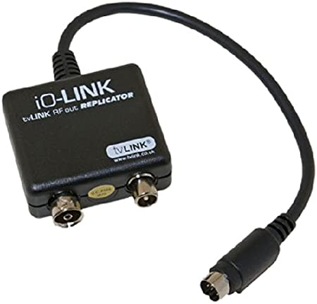

# MC44BS373CA-rf-modulator-controller

A simple Arduino-based controller for an I2C RF Modulator

* NXP MC44BS373CA
* Abilis ASE373

[Details of this project are on my blog.](https://nick-elec.blogspot.com/2020/02/experimenting-with-programmable-rf.html)

## Circuit assembled on stripboard

## Circuit assembled on breadboard

## Also compatible with Sky I/O Link

The signals in the Sky IO Link connectors are as below:

* pin 4 - 5V
* pin 5 - GND
* pin 6 - SCL
* pin 7 - SDA
* pin 8 - video
* pins 2 and 3 - audio
